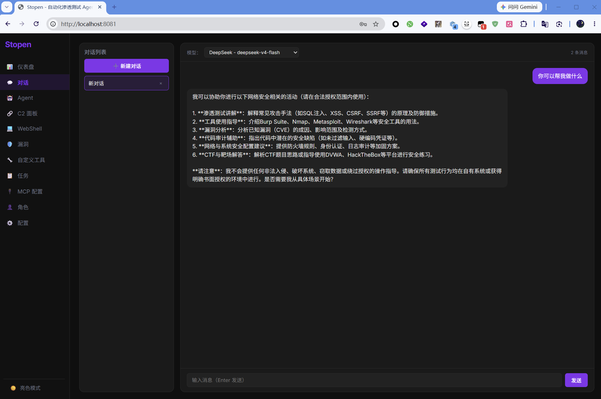
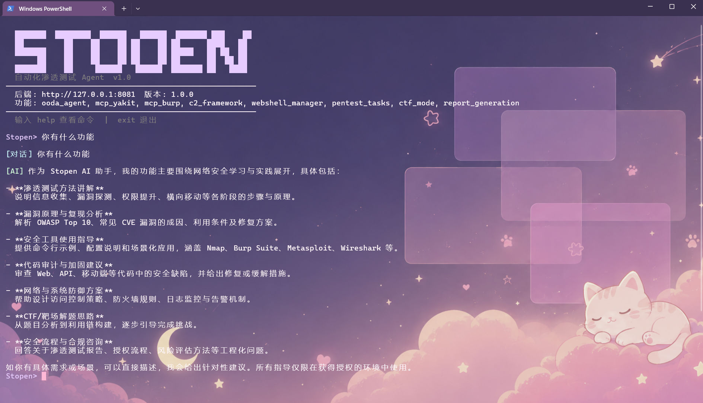
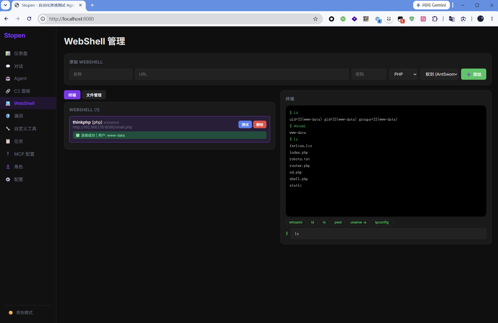

# Stopen — 自动化渗透测试 Agent

> OODA 循环 + 黑板驱动 + 多工具集成



---

## 一、快速启动

### 1.1 启动后端

```powershell
cd Stopen
python run.py
```

| 参数 | 说明 |
|------|------|
| `--port 8081` | 指定端口（默认 8080） |
| `--host 0.0.0.0` | 监听所有网卡（局域网可访问，需配合 `--no-reload`） |
| `--no-reload` | 禁用热重载 |

环境变量: `$env:STOPEN_PORT=8081`

> 安全提醒：默认只监听 `127.0.0.1`（本机），局域网访问需加 `--host 0.0.0.0`。
> 开放到局域网前请确保其他用户可信，因为当前无认证机制。

### 1.2 访问 WebUI

打开浏览器 → `http://localhost:8080`

### 1.3 CLI 终端

```powershell
python cli.py                 # 交互式 REPL 模式
python cli.py run 192.168.1.1 # 一键渗透测试
python cli.py status          # 系统状态
python cli.py --port 8081     # 指定后端端口
```



---

## 二、首次配置

### 2.1 配置 API Key

WebUI → 左侧导航 → **配置** → 选择 LLM 提供商 → 输入 API Key → 勾选启用 → 保存

目前支持 12 家 LLM 提供商：

| 提供商 | 获取 Key 地址 |
|--------|---------------|
| OpenAI | https://platform.openai.com/api-keys |
| Anthropic | https://console.anthropic.com/settings/keys |
| Google (Gemini) | https://aistudio.google.com/app/apikey |
| DeepSeek | https://platform.deepseek.com/api_keys |
| Kimi (月之暗面) | https://platform.moonshot.cn/console/api-keys |
| MiniMax | https://platform.minimaxi.com/user-center/basic-information/interface-key |
| 智谱 GLM (Z.ai) | https://open.bigmodel.cn/usercenter/apikeys |
| 字节豆包 (Doubao) | https://console.volcengine.com/ark/region:ark+cn-beijing/apiKey |
| 通义千问 (Qwen) | https://help.aliyun.com/zh/model-studio/developer-reference/get-api-key |
| SiliconFlow | https://cloud.siliconflow.cn/account/ak |
| 百川 (Baichuan) | https://platform.baichuan-ai.com/console/apikey |
| 自定义 | 任意 OpenAI 兼容接口 |

> API Key 会被 **AES 加密存储**在 `storage/config.enc`，密钥文件为 `storage/keyfile.key`，不会明文泄漏。

### 2.2 配置 MCP 服务器（可选）

MCP（Model Context Protocol）服务器可将外部安全工具集成到 Stopen 的 Agent 工具列表中。

WebUI → **MCP 配置** → 添加服务器

| 服务器 | 类型 | 地址 | 功能 |
|--------|------|------|------|
| Yakit | HTTP | `http://127.0.0.1:8082/mcp` | 端口扫描、FOFA 搜索、子域名枚举、CVE 查询 |
| Burp Suite | HTTP/SSE | `http://127.0.0.1:9876/sse` | 代理抓包、扫描器、Repeater、Intruder |
| Wireshark (tshark) | Stdio | `tshark` | 网络流量捕获与分析 |
| 科来 (CSNAS) | Stdio | `cmdl.exe` | 网络协议分析与取证 |

---

## 三、功能详解

### 3.1 对话（Chat）

导航 → **对话**

对话模块提供与 LLM 的自然语言交互界面：

- **多轮对话**：上下文持续，支持连续问答
- **模型选择**：顶部下拉菜单位选择要使用的 LLM 模型（仅显示已配置 API Key 且已启用的模型）
- **对话管理**：
  - 左侧面板列出所有对话
  - 「➕ 新建对话」按钮创建新对话
  - 点击切换、× 删除
- **消息展示**：用户消息紫色气泡（右对齐），AI 回复灰色气泡（左对齐）
- **发送方式**：Enter 发送，Shift+Enter 换行

> 对话模块不走 OODA Agent 循环，适用于普通咨询和知识问答。

### 3.2 Agent 渗透控制台

导航 → **Agent 控制台**

Agent 控制台是 Stopen 的核心功能入口，使用 OODA 循环驱动自动化渗透测试。

**参数说明**：

| 参数 | 说明 |
|------|------|
| 目标 | IP 地址 / 域名 / URL |
| 目标说明 | 可选的任务补充描述 |
| 任务类型 | 渗透测试 / CTF 模式 / CTF Web / CTF 密码学 |
| 角色 | 可选，选择后注入对应技能提示词 |
| 持久化模式 | 复选框勾选，多周期执行，每周期自动出报告 |

**渗透流程**：

```
目标 → 端口扫描 → 服务识别 → 漏洞扫描 → CVE 查询 → 利用 → 报告
```

**界面说明**：

- **左侧终端区域**：实时显示 Agent 的流式输出（思考过程、工具调用、结果）
- **右侧黑板面板**：
  - **Facts**（已确认发现）：端口开放、Web 路径、CVE 信息、Flag 等
  - **Intents**（待探索方向）：待扫描的端口、待爆破的目录等
  - 使用「刷新」按钮手动更新状态

**核心规则**：
- 每个发现必须有工具输出原文佐证（反幻觉门）
- 连续失败 3 次或达到 15 次迭代自动停止
- CTF 模式下找到 flag 后立即报告

### 3.3 WebShell 管理

导航 → **WebShell**

WebShell 模块支持三种主流 Webshell 协议的连接与操作。

**三种协议对比**：

| 协议 | 传输方式 | 密钥生成 | 加密 |
|------|----------|----------|------|
| 蚁剑 (AntSword) | `POST pass=system('cmd');` | 明文密码直接发送 PHP 代码 | 无 |
| 冰蝎 (Behinder) | `POST pass=AES-128-CBC(payload)` | MD5(password)[:16] | AES-128-CBC |
| 哥斯拉 (Godzilla) | `POST pass=AES-128-CBC(payload)` | MD5(password + key_suffix)[:16] | AES-128-CBC |

**功能列表**：

| 功能 | 说明 |
|------|------|
| 添加 WebShell | 填写名称 / URL / 密码 / 类型 (PHP/ASP/ASPX/JSP) / 协议 |
| 测试连接 | 点击「测试」按钮，结果显示在卡片下方（绿=成功，红=失败） |
| 删除 | 点击「删除」→ 确认 → 从列表中移除 |
| 交互式终端 | 命令历史 / ↑↓ / Ctrl+C / clear / 快捷按钮 |
| 文件管理器 | 列目录 / 读文件 / 写文件 / 删除 / 新建目录 |

**交互式终端快捷键**：

| 操作 | 效果 |
|------|------|
| ↑ 键 | 上一条命令历史（最多 50 条） |
| ↓ 键 | 下一条命令历史 |
| Enter | 执行当前命令 |
| Ctrl+C | 中断（显示 ^C 后回到提示符） |
| `clear` | 清空终端显示 |

**快捷命令按钮**：whoami / id / ls / pwd / uname -a / ipconfig

**文件管理器操作**：
1. 先选择对应的 WebShell
2. 点击「文件管理」标签
3. 输入路径（默认 /），点击「列目录」
4. 点击文件名读文件，点击目录名进入子目录



### 3.4 C2 框架

导航 → **C2 面板**

C2（Command & Control）框架用于管理远程主机的控制信道。

**监听器类型**：

| 类型 | 说明 | 适用场景 |
|------|------|----------|
| TCP Reverse | 反向连接监听器 | 目标可主动连接外网 |
| HTTP Beacon | HTTP 轮询通信 | 防火墙严格的环境 |
| WebSocket | WebSocket 持久连接 | 需要低延迟双向通信 |

**加密方式**（每个监听器独立配置）：

| 加密 | 算法 | 适用场景 |
|------|------|----------|
| AES-256-CTR | 对称加密，IV 随机 | 默认推荐，安全性最高 |
| XOR | 简单异或加密 | 兼容性优先，无依赖 |

**Payload 生成**：

| Payload 类型 | 加密 | 说明 |
|-------------|------|------|
| Python (TCP) | AES-256-CTR | Python TCP 反弹 Shell，功能完整 |
| Python (HTTP) | AES-256-CTR | HTTP Beacon 轮询 |
| Python (WS) | AES-256-CTR | WebSocket 持久连接 |
| PowerShell (TCP) | AES-CBC | Windows 原生，AES 加密通信 |
| Bash (TCP) | AES-256-CTR | Linux 原生，通过 Python 进程实现加密 |

**自定义 Payload 模板**：
- 通过「Payload 模板」标签页进行 CRUD 操作
- 模板内容支持三个占位符：`{host}`、`{port}`、`{secret}`
- 生成 Payload 时可通过 `listener_id` 参数自动匹配监听器密钥

**注意**：HTTP 和 WebSocket 监听器依赖 `aiohttp` 库。

### 3.5 漏洞管理

导航 → **漏洞**

**漏洞来源**：
- **自动写入**：Agent 运行过程中查询 CVE 时自动创建漏洞记录
- **手动创建**：填写标题、目标、严重度、类型、描述、证据

**严重度分级**：

| 级别 | 颜色 | 说明 |
|------|------|------|
| Critical | 🔴 红色 | 可远程 RCE，影响严重 |
| High | 🟠 橙色 | 高危漏洞，需优先处理 |
| Medium | 🟡 黄色 | 中危漏洞，需关注 |
| Low | 🔵 蓝色 | 低危信息泄露 |
| Info | ⚪ 灰色 | 信息类提示 |

**状态工作流**：`open → confirmed → fixed → false_positive`

**操作**：
- 创建 / 编辑 / 删除漏洞
- 按严重度或状态筛选
- 统计面板：总数 / 严重度分布 / 状态分布
- 一键生成 Python PoC 验证脚本（基于漏洞信息填充）

### 3.6 自定义 YAML 工具

导航 → **自定义工具**

用户可以无需编写 Python 代码，通过 UI 创建 YAML 格式的工具定义，自动注册到 Agent 工具注册表。

**两种模式**：

**子进程模式** — 执行本地命令行工具：

```yaml
name: nmap_scan
description: "Nmap 端口扫描"
category: scanner
type: subprocess
command: ["nmap", "-sV", "-p", "{ports}", "{target}"]
parameters:
  target: { type: string, description: "目标 IP/域名" }
  ports: { type: string, default: "80,443,8080" }
timeout: 120
```

**API 模式** — 调用外部 HTTP 接口：

```yaml
name: shodan_search
description: "Shodan 搜索"
category: scanner
type: api
command: "https://api.shodan.io/shodan/host/search"
parameters:
  query: { type: string, description: "搜索语法" }
timeout: 30
```

**操作流程**：
1. 填写名称、描述、类型、命令、参数 JSON、超时
2. 点击「测试」验证工具是否能正常运行
3. 点击「🔄 重载到 Agent」将工具注册到 Agent 工具列表
4. 在 Agent 控制台中即可调用该工具

### 3.7 报告与 PoC 生成

导航 → **任务**

**报告格式**：

| 格式 | 特点 |
|------|------|
| Markdown | 文本格式，易于阅读和版本控制 |
| HTML | 带样式表格，适合直接浏览器查看 |

**PoC 脚本**：基于漏洞信息自动生成 Python 验证脚本，包含：
- 目标 URL
- 漏洞类型和描述
- HTTP 请求验证
- 输出格式化

**持久化模式**：Agent 每完成一个周期自动生成周期报告。

### 3.8 MCP 配置

导航 → **MCP 配置**

MCP（Model Context Protocol）服务器的两种运行模式：

| 模式 | 原理 | 适用 |
|------|------|------|
| HTTP | JSON-RPC 2.0 over HTTP | Yakit、Burp Suite 等提供 HTTP API 的工具 |
| Stdio | 子进程 stdin/stdout JSON-RPC | Wireshark、科来等命令行工具 |

Stdio 模式下，command 和 args 会直接启动子进程，请确保命令可信。

### 3.9 角色系统

导航 → **角色**

**预定义角色**（6 个）：

| 角色 | 说明 |
|------|------|
| 渗透测试 (Pentest) | 端口扫描→漏扫→利用的完整流程 |
| CTF 模式 | 自动 CTF 解题流程 |
| Web 扫描 | 侧重 Web 安全检测 |
| API 测试 | API 安全测试 |
| 信息收集 | 仅信息收集阶段 |
| 报告生成 | 结果汇总和报告 |

**自定义角色**：用户可自行创建角色，配置名称、描述、系统提示词和关联的技能。

### 3.10 主题切换

侧边栏底部按钮切换 ☀️ 亮色 / 🌙 暗色模式，通过 localStorage 持久化，页面刷新后保持。

---

## 四、CLI 命令

| 命令 | 参数 | 说明 |
|------|------|------|
| `target` | `<host>` | 设置渗透目标 |
| `goal` | `<描述>` | 设置目标说明 |
| `run` | `[目标]` | 全自动渗透测试 |
| `recon` | `[目标]` | 信息收集 |
| `scan` | `[目标]` | 漏洞扫描 |
| `exploit` | `[目标]` | 漏洞利用 |
| `tools` | — | 列出所有可用工具 |
| `status` | — | 系统状态（含黑板、工具分类） |
| `listeners` | — | C2 监听器列表 |
| `sessions` | — | 活跃 C2 会话 |
| `webshells` | — | WebShell 列表 |
| `vulns` | — | 漏洞列表 |
| `config providers` | — | 查看 LLM 提供商状态 |
| `think` | `on/off` | 切换思考过程显示 |
| `health` | — | 检查后端连接 |
| `help` | — | 显示帮助 |
| `exit` / `q` | — | 退出 |

输入任意自然语言会自动走 LLM 对话。

---

## 五、项目结构

```
Stopen/
├── run.py                    # 后端启动入口（支持 --port / --host 参数）
├── cli.py                    # CLI 终端（交互式 + 单次命令模式）
├── .gitignore                # Git 排除规则
├── README.md                 # 英文说明文档
├── README_CN.md              # 中文说明文档（本文件）
├── stopen/
│   ├── main.py               # FastAPI 应用入口 + 路由注册 + 工具初始化
│   ├── app_config/           # 系统配置模块
│   │   ├── encryption.py     # AES (Fernet) 加密存储 API Key
│   │   ├── providers.py      # 12 家 LLM 厂商定义（模型列表、API 地址）
│   │   ├── auth.py           # Bearer Token 认证中间件
│   │   ├── settings.py       # 全局常量（路径、迭代上限等）
│   │   └── logging_config.py # 日志配置
│   ├── models/               # Pydantic 数据模型
│   │   ├── chat.py           # WebShell、消息创建模型
│   │   ├── c2.py             # 监听器、会话、任务模型
│   │   ├── task.py           # 渗透任务模型
│   │   └── report.py         # 报告模型
│   ├── routes/ (11 模块)     # FastAPI 路由
│   │   ├── agent.py          # OODA Agent SSE 流式执行
│   │   ├── c2.py             # C2 监听器/会话/Payload 模板 CRUD
│   │   ├── chat.py           # 对话 API（LLM 直连，不走 Agent）
│   │   ├── config.py         # LLM 提供商配置 CRUD + 测试
│   │   ├── mcp_config.py     # MCP 服务器 CRUD + stdio 支持
│   │   ├── roles.py          # 角色 CRUD（内置 + 自定义）
│   │   ├── tasks.py          # 任务管理 + 报告/PoC 生成
│   │   ├── tools.py          # 工具列表 + MCP 状态
│   │   ├── vulnerabilities.py# 漏洞 CRUD + 统计
│   │   ├── webshell.py       # WebShell + 文件操作 API
│   │   └── yaml_tools.py     # 自定义 YAML 工具 CRUD + 重载
│   ├── services/             # 业务逻辑层
│   │   ├── agent_loop_ooda.py # OODA 核心循环引擎
│   │   ├── blackboard.py      # 黑板（Fact/Intent/Goal 数据结构）
│   │   ├── c2_service.py      # C2 引擎（监听器管理 + 加密 + Payload 生成）
│   │   ├── webshell_service.py# WebShell 三协议实现（蚁剑/冰蝎/哥斯拉）
│   │   ├── db_service.py      # SQLite 数据库操作（13 张表）
│   │   ├── llm_client.py      # LLM HTTP 客户端（支持 OpenAI/Anthropic 格式）
│   │   ├── llm_service.py     # LLM 服务封装
│   │   ├── report_service.py  # 报告 + PoC 脚本生成
│   │   ├── skills_service.py  # 技能文件加载
│   │   ├── tool_base.py       # 工具抽象基类
│   │   ├── tool_registry.py   # 工具注册表单例
│   │   └── tools/             # 内置渗透工具实现
│   │       ├── scanners.py    # 端口扫描/目录枚举/子域名/CVE
│   │       ├── web_tools.py   # HTTP 请求/浏览器/Burp
│   │       ├── crypto_tools.py# 29 种编解码加密操作
│   │       ├── space_search.py# FOFA/Hunter/Shodan 搜索引擎
│   │       ├── js_discovery.py# JS 资产发现/未授权/目录枚举
│   │       ├── mcp_bridge.py  # MCP 桥接器（HTTP + Stdio）
│   │       └── yaml_loader.py # YAML 自定义工具运行时加载
│   ├── frontend/             # React SPA 前端
│   │   ├── index.html         # 入口 + CSS 变量 + 双主题
│   │   ├── src/
│   │   │   ├── main.jsx       # React 入口
│   │   │   └── App.jsx        # 完整 SPA（~800 行，含全部 11 个页面）
│   │   └── dist/              # Vite 构建产物（gitignored）
│   ├── skills/ (8 个)        # 渗透技能知识库 (.md 文件)
│   │   ├── recon.md           # 信息收集方法论
│   │   ├── vuln_discovery.md  # 漏洞发现方法论
│   │   ├── exploitation.md    # 漏洞利用方法论
│   │   ├── post_exploit.md    # 后利用方法论
│   │   ├── report.md          # 报告生成方法论
│   │   ├── ctf_web.md         # CTF Web 解题指南
│   │   ├── ctf_crypto.md      # CTF 密码学指南
│   │   └── ctf_reverse.md     # CTF 逆向指南
│   ├── TPIAN/                # 界面截图
│   │   ├── Web.png            # WebUI 首页截图
│   │   ├── Cli.png            # CLI 终端截图
│   │   └── Webshell-web.png   # WebShell 页面截图
│   └── storage/              # 运行时数据（.gitignore 排除）
│       ├── stopen.db          # SQLite 主数据库
│       ├── config.enc         # AES 加密的 API Key 配置
│       ├── keyfile.key        # 加密密钥文件
│       ├── .auth_secret       # 认证 token
│       └── logs/              # 运行日志
```

---

## 六、开发指南

### 构建前端

前端使用 Vite + React 构建，开发前需要安装 npm 依赖：

```powershell
cd stopen/frontend
npm install
npx vite build          # 生产构建
npx vite                # 开发模式（默认端口 3000）
```

### 后端开发

```powershell
# 热重载模式（修改代码自动重启）
python run.py

# 不带热重载
python run.py --no-reload

# 指定端口
python run.py --port 8081
```

### 代码规范

- 后端：Python 3.10+，FastAPI，SQLite，全 async/await
- 前端：React 18 + Vite，单文件 SPA，CSS 变量主题
- 日志：自动滚动日志文件，位置 `storage/logs/stopen.log`
- 所有 emoji 输出已替换为 ASCII `[标签]` 格式（Windows GBK 终端兼容）

---

## 七、安全说明

1. **API Key 加密存储**：使用 Fernet (AES) 对称加密存储在磁盘上，非明文
2. **认证机制**：所有 `/api/*` 路由（除 `/api/health`、`/api/auth/*` 外）需要 Bearer Token 认证，token 自动生成并持久化到 `storage/.auth_secret`
3. **CORS**：白名单机制，仅允许 `localhost:3000/8080/8081`，无通配符
4. **默认监听**：只监听 `127.0.0.1`，开放局域网需 `--host 0.0.0.0` 显式指定
5. **C2 通信**：AES-256-CTR / XOR 加密（每个监听器独立配置密钥）
6. **C2 密钥**：API 返回时自动掩码为 `****`
7. **WebShell 密码**：以明文存储在 SQLite 数据库中，请确保 `storage/` 目录访问受控
8. **`.gitignore`**：已排除 `*.db`、`*.enc`、`*.key`、`logs/`、`reports/`、`.auth_secret`
9. **YAML 工具 / MCP Stdio**：command 直接传递给子进程，请确保添加的命令可信

---

## 八、架构

### OODA 循环 + 黑板驱动

```
┌──────────────────────────────────────────────┐
│  OODA Loop (最多 15 次迭代)                  │
│  ┌──────┐   ┌──────┐   ┌──────┐   ┌──────┐  │
│  │Observe│──→│Orient│──→│Decide│──→│ Act  │  │
│  │ 观察  │   │ 定位  │   │ 决策  │   │ 行动 │  │
│  └───┬───┘   └───┬───┘   └───┬───┘   └───┬──┘│
│      │           │           │           │   │
│      ▼           ▼           ▼           ▼   │
│  ┌──────────────────────────────────────────┐│
│  │           黑板 (Blackboard)              ││
│  │  Facts: 已确认的发现                      ││
│  │   端口/服务/漏洞/Web路径/Flag             ││
│  │  Intents: 待探索的方向                     ││
│  │   端口扫描/目录爆破/漏洞利用               ││
│  │  Goal: 渗透目标 + 达成标记                 ││
│  └──────────────────────────────────────────┘│
└──────────────────────────────────────────────┘
```

### Reflexion 递进引擎

当工具调用连续失败时，自动递进载荷等级：

```
L0: 原始 payload
L1: URL/Base64 编码
L2: 转义/双写
L3: 命令替换/Unicode
L4: 混淆/换攻击面
```

### 反幻觉门

- 所有"发现"必须有工具输出原文佐证
- Flag 必须逐字出现在工具输出中才接受
- 防止 LLM 编造渗透结果

---

## 九、已知问题

1. **WebSocket Payload 加密不兼容**：Python WS Payload 现在使用 AES-256-CTR 加密，但服务端 `_start_ws()` 的加密方式可能不匹配。实际使用中建议先测试验证。
2. **HTTPS/WSS 不支持**：HTTP 和 WebSocket 监听器目前只支持明文协议。生产环境如需加密，建议使用反向代理（如 Nginx）终止 TLS。
3. **SQLite 单连接**：数据库使用单个连接，高并发场景可能性能受限。当前为单用户工具，影响有限。
4. **速率限制**：所有 API 端点目前无速率限制。

---

*Stopen v1.0 — 自动化渗透测试 Agent*
